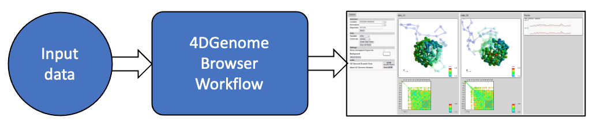
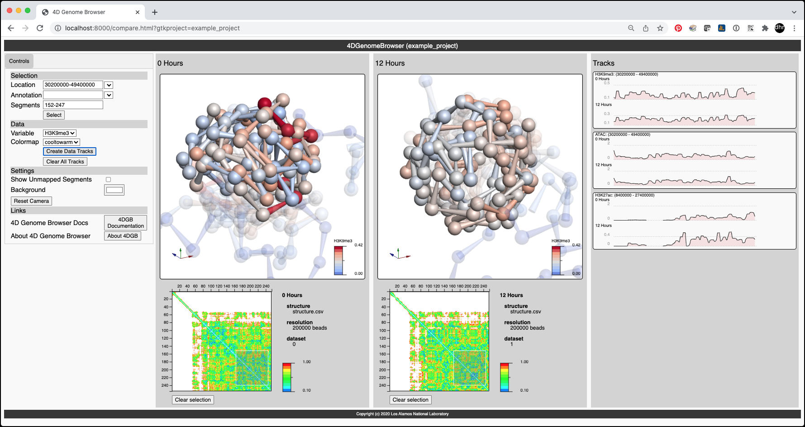

# 4DGB Workflow



A dockerized application implementing an end-to-end workflow to process Hi-C data files and displaying their structures in an instance of the [4D Genome Browser](https://github.com/lanl/4DGB).

The workflow takes ```.hic``` data, processes the data and creates a running server that can be used to view the data with a web browser. The system takes advantage of previous runs, so if you've already computed some data, it won't be recomputed the next time the workflow is run. 

## First Example

This repository contains the first end-to-end example of the 4D Genome Browser workflow. Here's how to get started:

1. Install Docker. Instructions are [here](https://docs.docker.com/get-docker).

2. Clone this repository:

```sh
git clone --recursive https://github.com/4DGB/4DGBWorkflow.git 
```

3. CD into the repository and build the Docker image. This may take a bit of time, but you will see messages in the shell while it's running:

```sh
cd 4DGBWorkflow
docker build -t 4dgbworkflow .
```

4. Run the workflow. The result will be a running server.

```sh
./run_project ./example_project 
```

**Example output:**
```sh
$ ./run_project ./example_project
[>]: Building project... (this may take a while)

        #
        # Ready!
        # Open your web browser and visit:
        # http://localhost:8000/compare.html?gtkproject=example_project
        #
        # Press [Ctrl-C] to exit
        #
```

5. Run Chrome browser on the running server at this address: ```http://localhost:8000/compare.html?gtkproject=example_project```. You'll see the following result (may need to resize the browser window):



## General Instructions

More general instructions for creating workflows from scratch are underdevelopment.

- The [File Specification Document](doc/file_specs.md) shows full details on what can be included in the input data.

